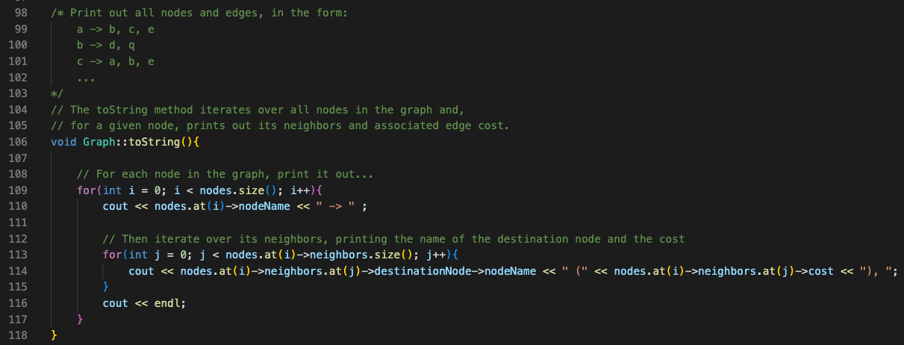
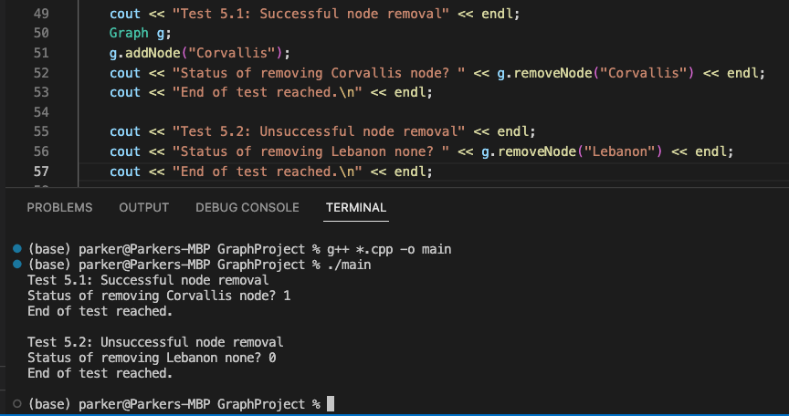

## 1. "Create a design before you start coding that describes or shows how a graph structure could be used to store some kinds of data and solve some kind of problem (yes, this can be a game that needs a graph to represent a map!)"

### Design Overview

The context: You are one of OSU's food delivery robots. Given a map of the campus (weighted directed graph stored as an adjacency list), you have a sense of the motor power required (edge costs) to get from location to location (locations are nodes).

You have the ability to find the shortest path from your current location to any other location on campus, and can generate a minimum spanning tree of the graph (NOTE: I now realize that directed graphs don't generally work to find MSTs given their often disconnected nature—however, I think I still found a way to make it work in this case (see below)).

### Design Details

This project consists of

A graph class with:

- a vector to store all the nodes in the graph
- (added during implementation) some unordered sets to store Parent nodes and node Rank (used during the disjointed set unioning for Kruskal's)
- A method to add a node to the graph, given the node's name (see screenshot in section 3 below)
- A method to add an edge given source and destination node names and edge cost (see screenshot in section 3 below)

- A method to remove a node given its name

- A method to remove an given name of source and destination nodes

- A toString method to print out the graph

- A shortestPath method that uses Dijkstra's Algorithm to find the shortest path from a source node to a destination node, then prints the cost of the shortest path as well as the path to get there (using the printShortestPath method) (see screenshot in section 3 below)
- A minimumSpanningTree method that uses Kruskal's Algorithm to find the graph's minimum spanning tree (using the compareEdgeCosts, find, and setUnion methods as well) (see screenshot in section 3 below)

A node struct that stores:

- The name of the node
- An adjacency list of its neighbors (vector of edge pointers)
- An ID number (used for selecting certain nodes in Dijkstra's algorithm)

An edge struct that stores:
- A pointer to a source node
- A pointer to a destination node
- An associated edge cost (or "weight")

## 2. "Create some tests (at least two for each piece of functionality) before you start coding..."

Note: More testing of functionality takes place in the "Demo" section of the project below.

### Test 0: Graph constructor

- Test 0.1 Default constructor (only one test makes sense here).

### Test 1: Node constructor

- Test 1.1: Non-default constructor (no default)

### Test 2: Edge constructor

- Test 2.1: Non-default constructor (no default)

### Test 3: addNode method

- Test 3.1: Adding node with a name

- Test 3.2: Adding node without a name

### Test 4: addEdge method

- Test 4.1: Successful edge adding

- Test 4.2: Unsuccessful edge adding

### Test 5: removeNode method

- Test 5.1: Successful node removal

- Test 5.2: Unsuccessful node removal

### Test 6: removeEdge method

- Test 6.1: Successful edge removal

- Test 6.2: Unsuccessful edge removal

### Test 7: toString method

- Test 7.1: toString an empty graph

- Test 7.2: toString a sample graph with some nodes, edges

### Test 8: shortestPath and printShortestPath methods

- Test 8.1: Find and print shortest path where the source is the destination

- Test 8.2: Find and print shortest path where the source is not the destination

### Test 9: minimumSpanningTree method (and by association, compareEdgeCost, find, and setUnion methods)

- Test 9.1: Find MST of an unconnected graph

- Test 9.2: Find MST of a connected graph

## 3. "Implement a graph class with at least (this category effectively combines implementation and specification, partly to emphasize getting the algorithms working!)"

### (a) "a function to add a new vertex to the graph (perhaps add_vertex(vertex_name))"

### (b) "a function to add a new edge between two vertices of the graph (perhaps add_edge(source, destination) or source.add_edge(destination))"

### (c) "a function for a shortest path algorithm (perhaps shortest_path(source, destination))"

### (d) "a function for a minimum spanning tree algorithm (example min_span_tree())"

## 4. "Analyze the complexity of all of your graph behaviors (effectively a part of our documentation for grading purposes)"

